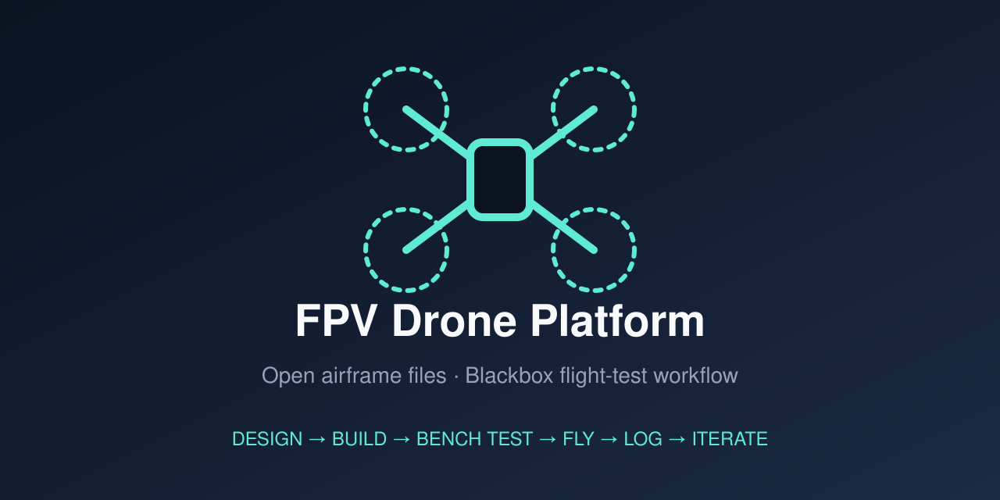

# TODO_PROJECT_NAME — FPV Drone Platform

  

  <strong>Open airframe files and a repeatable Blackbox flight-test workflow for FPV drones.</strong> 
  If this project helps your build, a <a href="https://github.com/mnswba/fpv/stargazers">Star</a> helps other builders find it.

**TODO_PROJECT_NAME** is an experimental FPV quadcopter platform developed by **TODO_TEAM_NAME**. TODO: one or two sentences on the goal (e.g. speed, endurance, cinematic, long range) and what makes the design different.

This repository is intended to make the design easier to inspect, reproduce, discuss, and improve. It is an engineering reference — not a certified aircraft, a universal build recipe, or a guarantee of speed, flight time, or structural safety.

> **Current status:** TODO (e.g. early prototype / active development / stable revision X). Dimensions, materials, propellers, electronics, and flight-control settings may change between revisions. Always inspect the files and configuration before manufacturing or flight testing.

## Project at a glance

| Focus | What is published | How to use it responsibly |
| --- | --- | --- |
| Airframe design | Printable parts, frame plates, motor mounts, propeller models | Start from a named revision; inspect clearances and fit before power-up |
| Repeatable flight testing | Reference Betaflight configuration and a Blackbox-based test workflow | Change one parameter family at a time; keep the `.bbl` log and `diff all` together |
| Open engineering exchange | Issues, Discussions, structured test reports, citation metadata | Report hardware revision, mass, material, propeller, battery, firmware, and test conditions |

## Start here

- **Understand the platform:** read the [reference hardware](#reference-hardware-configuration), [repository map](#repository-map), and [build workflow](#build-workflow).
- **Inspect printable parts:** open [`3d_printed_parts/`](3d_printed_parts/) and compare the STL/3MF revision with your printer and material.
- **Review the flight stack:** read [`betaflight_config.txt`](betaflight_config.txt) as a reference only, then back up your own controller with `diff all` before changing anything.
- **Report a result:** open a [test report issue](https://github.com/mnswba/fpv/issues/new/choose) or propose a documented change in a pull request.

## Why this project

- TODO: design goal 1 (e.g. low frontal area / aerodynamic shell).
- TODO: design goal 2 (e.g. easy-to-print parts with common filaments).
- TODO: design goal 3 (e.g. evidence-based tuning from Blackbox logs).
- **Open engineering discussion.** Builders can report a revision, test condition, result, and failure mode without reverse-engineering the whole project.

## Reference hardware configuration

Representative test setup — not a mandatory bill of materials. Check electrical, mechanical, and thermal compatibility before copying it.

| Subsystem | Reference configuration |
| --- | --- |
| Flight controller | TODO (board, Betaflight version) |
| ESC | TODO (current rating, protocol, bidirectional DShot yes/no) |
| Motors | TODO (size, KV) |
| Propellers | TODO (size, pitch, blade count) |
| Battery | TODO (cell count, capacity, C rating) |
| Video | TODO (analog / DJI / Walksnail / HDZero) |
| Receiver | TODO (ELRS / Crossfire / other) |
| GPS | TODO (optional) |
| Airframe | TODO (frame size, materials) |
| All-up weight | TODO (g, with battery) |

## Repository map

| Path | What it contains | Notes |
| --- | --- | --- |
| [`3d_printed_parts/`](3d_printed_parts/) | Canopy, shells, fairings, mounts, and 3MF print profiles | Review file revision and print profile before use |
| [`carbon_fiber_frame/`](carbon_fiber_frame/) | Frame plates and arm references (STL/DXF/STEP) | Revision-specific design references |
| [`cnc_motor_mount/`](cnc_motor_mount/) | CNC-machined motor mount files | Confirm units, tolerances, and hole pattern before machining |
| [`propellers/`](propellers/) | CW/CCW propeller models | Balance and inspect every propeller before flight |
| [`betaflight_config.txt`](betaflight_config.txt) | Reference flight-controller configuration (`diff all`) | Do not paste blindly; audit every setting |
| [`docs/`](docs/) | Build notes, wiring diagrams, test logs, reference documents | |
| [`assets/`](assets/) | Images used by the README and social preview | |
| [`LICENSE.txt`](LICENSE.txt) | Project license | TODO: choose a license |

## Build workflow

1. **Choose a revision.** Record the commit, file names, material, print process, and hardware revision before starting.
2. **Inspect the geometry.** Check wall thickness, clearances, motor-hole pattern, propeller clearance, cooling paths, antenna clearance, and battery retention.
3. **Validate the manufacturing process.** Confirm printer calibration, material drying, layer adhesion, support strategy, and post-processing.
4. **Check the power system.** Verify motor/propeller load, ESC current capability, battery voltage, connectors, polarity, solder joints, and insulation.
5. **Dry-fit before power.** Confirm that no part, fastener, cable, or fairing can contact a motor bell or propeller arc.
6. **Bench test without propellers.** Verify motor order/direction, receiver failsafe, arming logic, current sensor, video, GPS, and Blackbox logging. Use a smoke stopper on first power-up.
7. **Perform a short controlled flight test.** Use a legal, clear area with a known-good battery and propeller set. Land early if temperature, sound, vibration, or control response is abnormal.
8. **Record evidence.** Save the configuration backup, flight log, battery state, weather, test duration, peak current, motor temperature, and any incident.

## Flight-data and PID workflow

Do not tune from a propeller-less arm test: the motor tab is an open-loop check and does not reproduce the closed-loop gyro/PID/motor interaction in flight.

1. Enable Blackbox logging and record a short flight with a defined maneuver set.
2. Review the log (e.g. [Betaflight Blackbox Explorer](https://github.com/betaflight/blackbox-log-viewer) or [PIDtoolbox](https://pidtoolbox.com/)) for noise, motor saturation, and step response.
3. Change **one** parameter family (filters, PIDs, or feedforward) per test flight.
4. After each flight, check motor temperature by hand before the next change.
5. Keep the `.bbl` log, the matching `diff all`, and your notes together as one test record in [`docs/`](docs/) or an issue.

## Safety and responsible use

LiPo batteries, rotating propellers, high-current wiring, hot motors, and high-speed flight can cause serious injury, fire, or property damage. Users are responsible for:

- removing propellers during all bench and configuration work;
- using a fire-safe battery workflow and inspecting packs before use;
- checking local aviation, radio, privacy, and public-safety rules;
- testing only in a clear area with a recovery and emergency plan;
- stopping immediately after a hard impact, propeller strike, failsafe, loss of control, or abnormal motor temperature;
- verifying every firmware, ESC, motor, propeller, and battery setting on the actual aircraft.

This project is not intended for military, weapon, armed, or combat applications. No file here is a safety certification, airworthiness approval, or performance guarantee.

## Known limitations

- No universal BOM, validated print profile for every printer/material, or certified structural analysis is provided.
- STL and 3MF files are manufacturing artifacts, not a substitute for editable source CAD or dimensional inspection.
- The reference Betaflight configuration contains hardware-specific assumptions and must be audited before use.
- Flight results are revision-dependent and only comparable when mass, battery, propeller, firmware, weather, and test method match.

## Contributing and discussion

See [`CONTRIBUTING.md`](CONTRIBUTING.md). Use the structured issue form for a reproducible result or problem. A useful report includes the commit or revision, airframe mass, material and print settings, motor/propeller/battery combination, firmware, test conditions, log evidence, and the smallest reproducible change.

Please do not upload tokens, receiver identifiers, private flight data, GPS coordinates, personal addresses, or other credentials.

## Team and attribution

Developed by **TODO_TEAM_NAME**:

- TODO_NAME_1
- TODO_NAME_2

TODO: credit any designs, projects, or people that inspired or contributed to this work.

## License

TODO: choose a license and update [`LICENSE.txt`](LICENSE.txt), the badge above, and [`CITATION.cff`](CITATION.cff). Common choices for open hardware: CC BY-SA 4.0, CC BY-NC-SA 4.0 (non-commercial), or CERN-OHL-S/W/P.

Copyright © 2026 TODO_TEAM_NAME.
